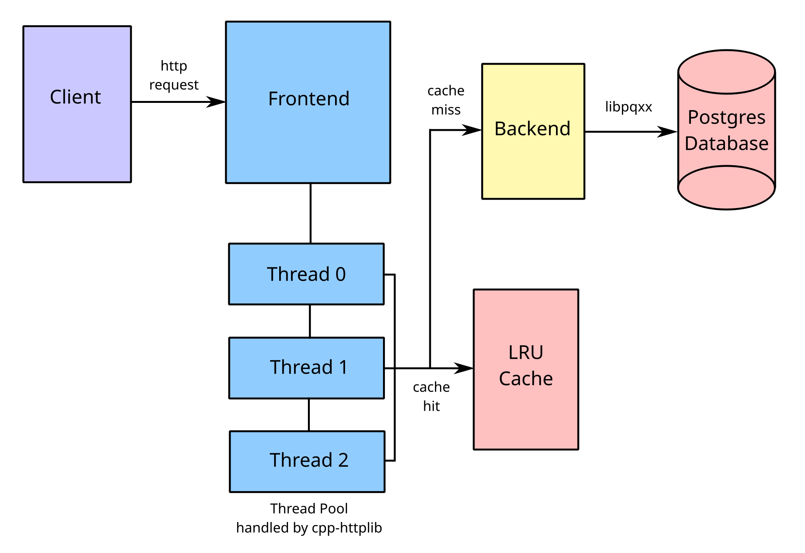

# HTTP based Key-Value Server with Caching

Shivang Goswami, 25m0780

This project is a two-tier key-value store built in C++ & uses PostgreSQL as database. It uses `cpp-httplib` for handling HTTP requests and `libpqxx` for PostgreSQL database integration. It also has a simple LRU cache, to provide repeatedly accessed keys quickly.

## Repository

`https://github.com/usanuemu/CS744_DECS_kvserver_25m0780`


## System Architecture

The system is divided into three separate programs:

  * Frontend Server: Handles client requests using multi-threads (port `5002`). Also maintains a in-memory LRUcache. And forward requests to the backend when necessary.
  * Backend Server: Handles the Postres database (port `5003`) that stores permanent key:values. It connects to Postgres using libpqxx library.
  * Client: Simple C++ program that makes few types of http requests to the Frontend server such as: Get("/kv/:key"), Post("/kv/:key"), Delete("/kv/:key")



### Memory-Based Request

In case of LRU cache hit, the value of requested `key` is accessed and returned by accessing the on-memory cache.
```
  std::unordered_map<std::string, std::string> cacheMap;
  bool get(const std::string& key, std::string& value_out) {
    std::lock_guard<std::mutex> lock(cacheMutex);
    std::iterator it = cacheMap.find(key);
    ...
  }

  std::string cached_value;
  if (cache.get(key, cached_value)){
    ...
  }
```

### Disk-Based Request

When the requested `key` is not in the cache or doesn't exist, then the Postgres database is accessed through `./backend` process, resulting in a disk access.
```
  pqxx::connection conn(POSTGRES_CONN_STRING);
  pqxx::work txn(conn);
  std::string sql = "SELECT value FROM kv_store WHERE key = $1";
  pqxx::result r = txn.exec_params(sql, key);
```

## Running Project

Prerequisites:
```
  g++
  make
  libpqxx-dev
  libpq-dev
```

Compile & Run:

```
  make
  ./backend
  ./frontend
  ./client
```
